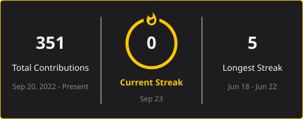

 

---

## QUI SUIS-JE

Un **Product Builder** passionné par l'impact.

Issu du monde du management digital (IT, réseau, sécurité), j'ai développé une approche hybride qui combine vision produit, design UX et développement — no-code comme code. Je construis des solutions qui résolvent de vrais problèmes pour de vraies personnes : je conçois, je prototype vite, et je pousse en prod.

---

## 🛠️ Mon Stack

**No-code produit**

**Data**

**Automatisation**

**IA**

**Langages & Frameworks**

---

## 🚀 Projets récents

| Projet | Description | Stack |
|--------|--------------|-------|
| 🎸 [**Unison**](https://chord-craft.vercel.app/) | PWA pour musiciens — accords transposables, setlists exportables en PDF et gestion de groupes | React · TypeScript · Supabase · PWA |
| 🎙️ [**SpeakIn**](https://github.com/DoubleRiz/SpeakIn) | App vocale qui transcrit une note en français via Gemini, la structure selon 5 templates, et l'envoie dans Notion | Next.js · TypeScript · Gemini API · Notion API |
| 📄 [**DocFlow**](https://github.com/DoubleRiz/docflow) | Publipostage moderne — éditeur et tableur synchronisés en temps réel, génération PDF/ZIP en masse | TanStack Start · Drizzle ORM · Neon · TipTap |

---

## 📊 GitHub Stats

---

*conçu avec 🟡 par Gautier*

